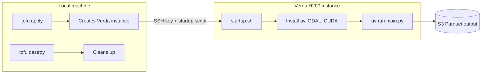
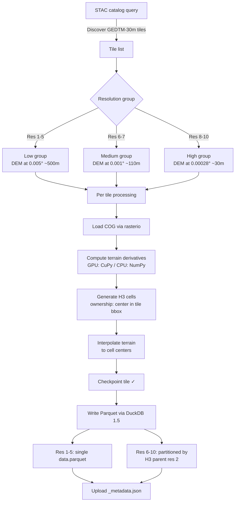
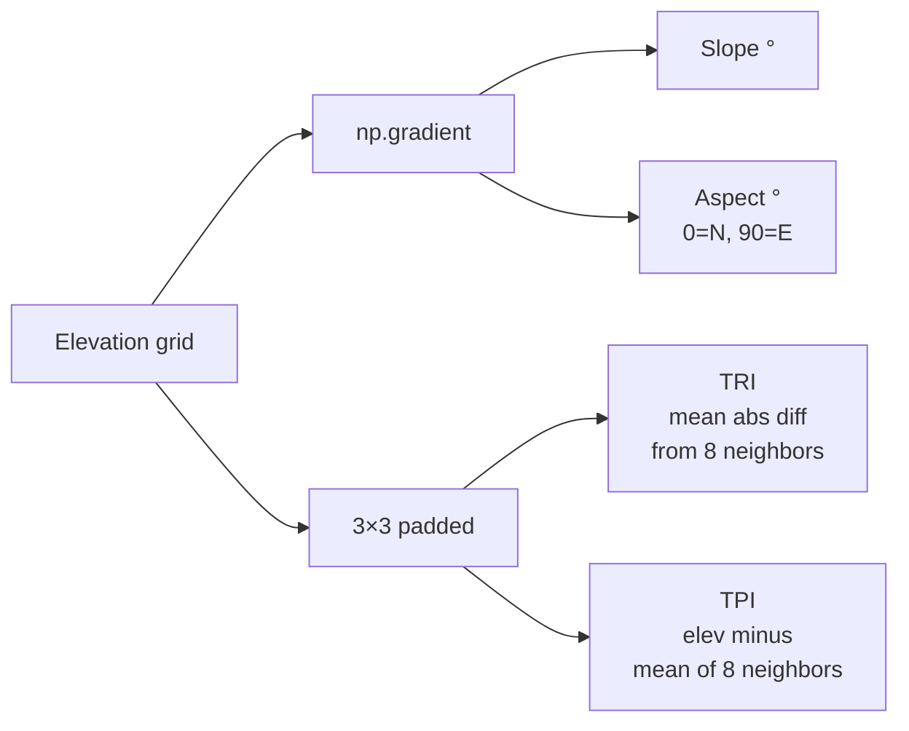
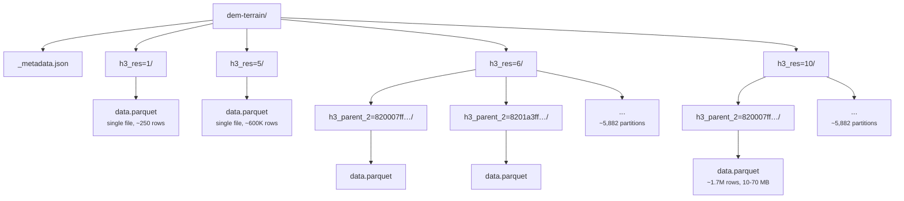

# Pipeline Workflow

## Architecture



## Processing pipeline



## Terrain derivatives

Computed on a per-tile basis from the elevation grid:



| Derivative | Unit | Description |
|------------|------|-------------|
| `elev` | meters | Mean elevation |
| `slope` | degrees | Steepness (0° = flat, 90° = vertical) |
| `aspect` | degrees | Downslope direction (0° = N, 90° = E, 180° = S, 270° = W) |
| `tri` | meters | Terrain Ruggedness Index — mean absolute elevation difference from 8 neighbors |
| `tpi` | meters | Topographic Position Index — elevation minus mean of 8 neighbors |

## H3 resolution strategy

Different DEM sampling rates per resolution group keep memory bounded while preserving spatial detail where it matters:

| H3 Res | Edge Length | DEM Sampling | Land Cells (approx) | Output Size (est.) |
|--------|-------------|--------------|---------------------|--------------------|
| 1 | ~418 km | 0.005° ~500m | ~250 | ~1 KB |
| 2 | ~158 km | 0.005° ~500m | ~1,800 | ~20 KB |
| 3 | ~60 km | 0.005° ~500m | ~12,000 | ~150 KB |
| 4 | ~22.6 km | 0.005° ~500m | ~86,000 | ~1 MB |
| 5 | ~8.5 km | 0.005° ~500m | ~600,000 | ~10 MB |
| 6 | ~3.2 km | 0.001° ~110m | ~4.2M | ~70 MB |
| 7 | ~1.2 km | 0.001° ~110m | ~30M | ~500 MB |
| 8 | ~461 m | 0.00028° ~30m | ~210M | ~3.5 GB |
| 9 | ~174 m | 0.00028° ~30m | ~1.5B | ~25 GB |
| 10 | ~66 m | 0.00028° ~30m | ~10B | ~170 GB |
| **Total** | | | | **~200 GB** |

## Partitioning



- **Res 1-5**: single `data.parquet` (all small enough)
- **Res 6-10**: Hive-partitioned by H3 parent at res 2 (~5,882 parents, keeps files 10-70 MB)
- **Within each file**: sorted by `h3_index` for spatial locality
- **Compression**: ZSTD level 3
- **Geometry**: native Parquet 2.11+ `GEOMETRY('EPSG:4326')` — DuckDB writes per-row-group bbox stats automatically

## Parquet schema

| Column | Type | Description |
|--------|------|-------------|
| `h3_index` | `VARCHAR` | H3 cell ID (hex string) |
| `geometry` | `GEOMETRY('EPSG:4326')` | Cell center as POINT (native Parquet 2.11+) |
| `lat` | `FLOAT` | Cell center latitude |
| `lon` | `FLOAT` | Cell center longitude |
| `elev` | `FLOAT` | Mean elevation (meters) |
| `slope` | `FLOAT` | Mean slope (degrees) |
| `aspect` | `FLOAT` | Mean aspect (compass degrees) |
| `tri` | `FLOAT` | Terrain Ruggedness Index (meters) |
| `tpi` | `FLOAT` | Topographic Position Index (meters) |

The `geometry` column uses the native Parquet GEOMETRY logical type (not GeoParquet metadata convention). DuckDB 1.5 automatically writes:
- Bounding box statistics per row group
- Geometry shredding for ~2x compression on Point data
- Files are valid as both native Parquet 2.11+ and GeoParquet simultaneously

## Checkpointing

The pipeline writes a `checkpoint.json` after each tile, tracking:

- Which tiles have been processed (by `{group}:{tile_id}`)
- Which resolutions have been fully written

If the pipeline crashes or is interrupted, restart it and it will skip already-completed work.

## Cloud instance

| Instance | CPUs | RAM | VRAM | Recommendation |
|----------|------|-----|------|----------------|
| 1A100.22V | 22 | 120 GB | 80 GB | Sufficient but slower on CPU-bound H3 |
| **1H200.44V** | **44** | **182 GB** | **141 GB** | **Best: most CPUs, fast GPU** |
| 1B200.30V | 30 | 184 GB | 180 GB | More VRAM (unused), fewer CPUs |

Estimated processing time: **~8-12 hours** on H200 (GPU-accelerated terrain derivatives, parallel tile I/O).

## Verification

After the pipeline completes:

```sql
-- 1. Confirm native GEOMETRY type (not BYTE_ARRAY)
SELECT * FROM parquet_schema('s3://bucket/prefix/dem-terrain/h3_res=5/data.parquet');

-- 2. Spot-check known elevations (Mount Everest area)
SELECT h3_index, elev, slope
FROM read_parquet('s3://bucket/prefix/dem-terrain/h3_res=5/data.parquet')
WHERE lat BETWEEN 27.5 AND 28.5 AND lon BETWEEN 86.5 AND 87.5
ORDER BY elev DESC LIMIT 5;

-- 3. Read across all resolutions with partition pruning
SELECT count(*), min(elev), max(elev)
FROM read_parquet('s3://bucket/prefix/dem-terrain/**/*.parquet', hive_partitioning=true)
WHERE h3_res = 7;
```
